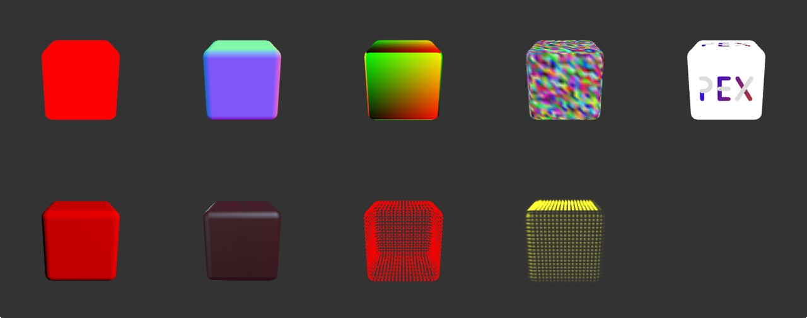

# pex-materials

Additional glsl materials for the PEX library



## Example

```
var ShowNormals = require('pex-materials/show-normals');
var showNormalsProgram = ctx.createProgram(ShowNormals.Vert, ShowNormals.Frag);
```

## Available materials


#### Solid Color
`var SolidColor     = require('pex-materials/solid-color');`

Uniforms:
`uColor` - [r,g,b,a]

#### Show Normals
`var ShowNormals    = require('pex-materials/show-normals');`

#### ShowTexCoords
`var ShowTexCoords  = require('pex-materials/show-tex-coords');`

#### ShowColors
`var ShowColors     = require('pex-materials/show-colors');`

#### Textured
`var Textured       = require('pex-materials/textured');`

Uniforms:
`uTexture` - Texture2D

#### Diffuse
`var Diffuse        = require('pex-materials/diffuse');`

Uniforms:
`uDiffuseColor` - [r,g,b,a]
`uLightPos` - [x, y, z], world space light position

#### MatCap
`var MatCap         = require('pex-materials/mat-cap');`

Uniforms:
`uTexture` - Texture2D

#### Point Sprite Solid Color
`var PointSpriteSolidColor = require('pex-materials/point-sprite-solid-color');`

Uniforms:
`uColor` - [r,g,b,a]

#### Point Sprite Textured
`var PointSpriteTextured   = require('pex-materials/point-sprite-textured');`

Uniforms:
`uTexture` - Texture2D
`uColor` - [r,g,b,a]
